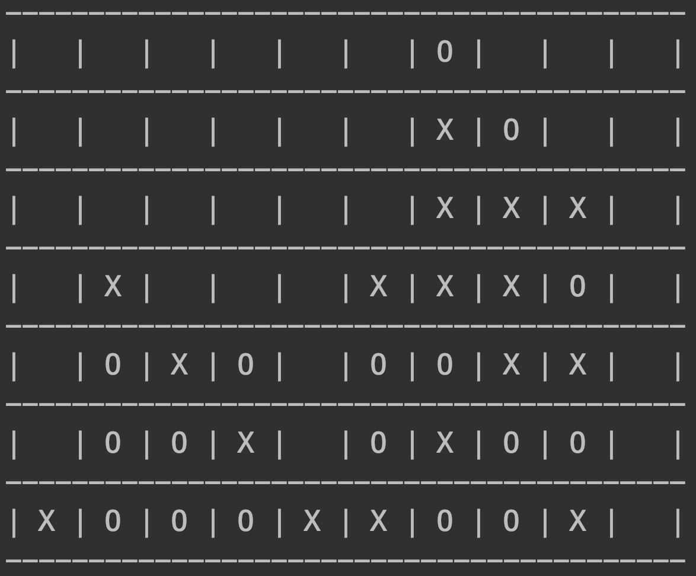

//Marlon Mueller-Soppart
//20200321

# What is this program?

A configurable, command-line version of Connect 4. It allows for custom amounts of rows, columns, and win-streaks[1].
\
[1] so this is actually Connect x where x is in NN



 
# How to run

method 1.\
Find the Program.fs file.\
Edit the config settings at the top of the file.\
```fsharp
//configurable settings
let NumRows = 6
let NumCols = 7
let NumToWin = 4
```
Put Program.fs in your favorite IDE and run it.\
\
method 2. (untested and not recommended)\
put in your command line\
```
/usr/local/share/dotnet/dotnet <absolute path to Connect4.dll file>
```
